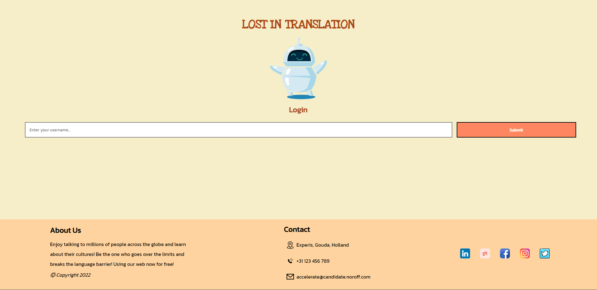
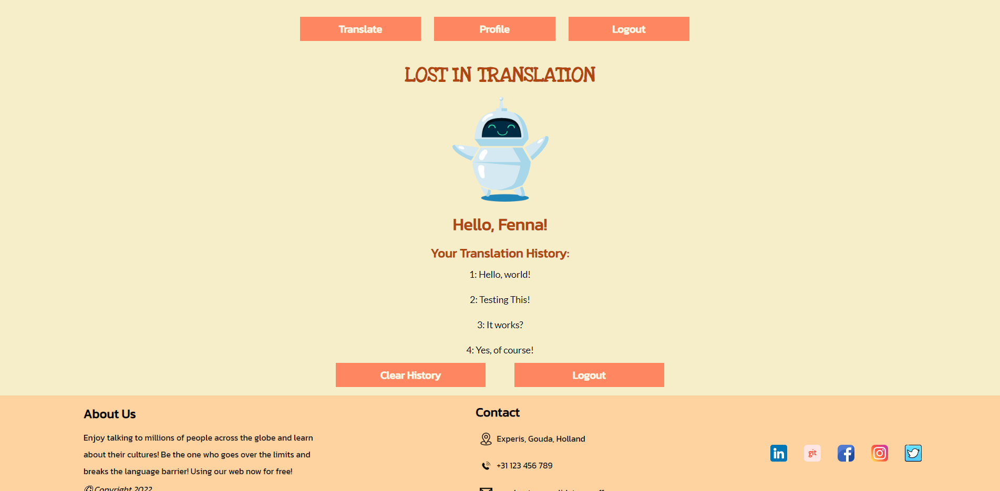
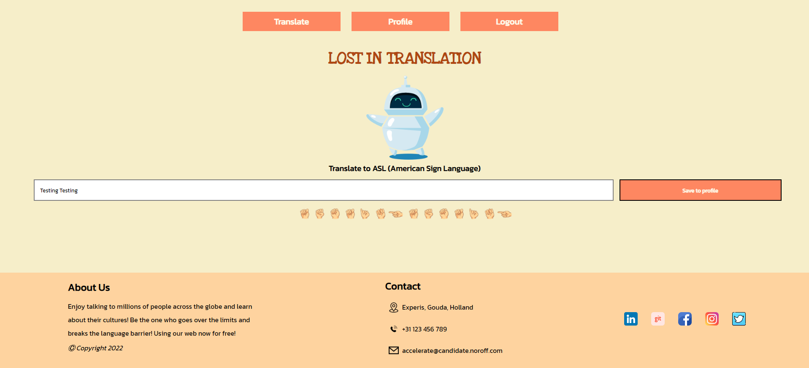

# Assignment 2 - Translation Website
Translation web application using React.
# Install
```
git clone https://gitlab.com/linhmillion/assignment2-react.git
```
# Usage
On web:
https://assignment2-react-linh.herokuapp.com/ 
On localhost:
```
npm start
```
This command runs a server on localhost:3000 (by default, though the port can be changed)
```
npm start port=PORTNUMBER
```
To create the .env file needed for using the API:
```
REACT_APP_API_URL = <your API url here>
REACT_APP_API_KEY = <your API key here>
```
and place this .env file in the ROOT-folder (not src or public!)
This should allow for all the functionality to work! 

# About This Project
* The user can login with a valid username
* If the username is not found, create new user
* User profile retrieves username to display personal message
* Translate page shows sign-language version of letters, or regular version of other characters
* Translate page allows user to save translations to their profile
* The user can navigate to /profile and /translate only if they are signed in
* The user can translate all letters, words and phrases to sign language
* The user can view their translate history on their profile
* The user can clear their translation history on their profile
* The user can logout
* The user gets redirected to /login screen once logged out

# Screenshots
# Login Page

# Profile Page

# Translate Page


# Authors and Acknowledgements
This project was created by [Linh Trieu(@linhmillion)](@linhmillion) and [Fenna Ransijn(@fransijn)](@fransijn). Fonts used from Google Fonts.  

# Project Status
* All features completed
